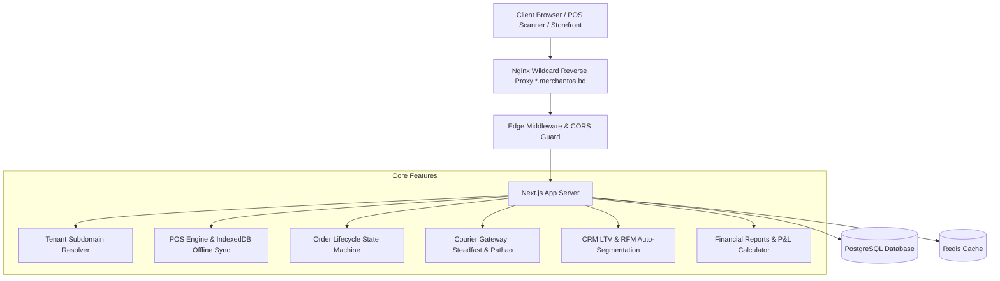
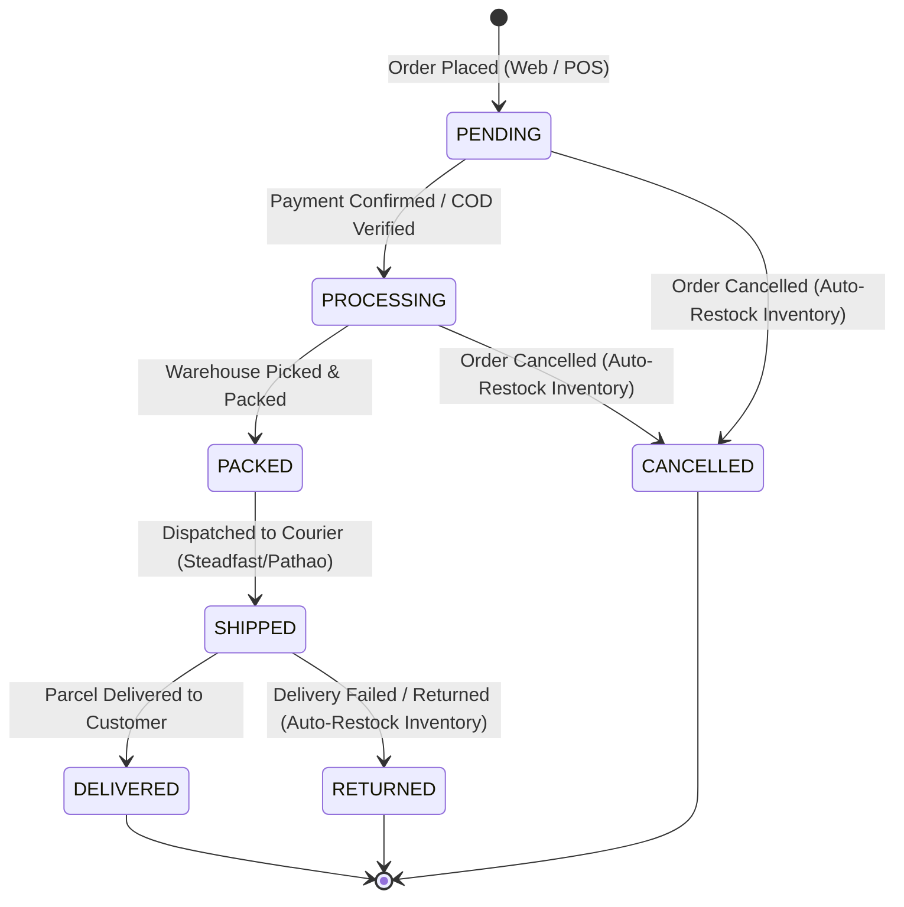

# System Architecture & Technical Specifications

This document details the architectural design, data flow models, state machines, and integration patterns of the SME Merchant OS platform.

---

## 🏗️ High-Level System Architecture

---

## 🏢 1. Multi-Tenant Context Isolation Model

- **Subdomain Routing:** Requests to `[tenantSlug].merchantos.bd` are parsed by `extractTenantSlugFromHost()`.
- **Database Isolation:** All tenant tables (`POSOrder`, `StoreCustomer`, `OrderCourierMapping`, `CRMCustomerProfile`, `MerchantExpense`) enforce a required `merchantId` foreign key with cascade deletion.
- **API Access Guard:** `validateMerchantApiAccess(request)` extracts JWT session claims and validates tenant authorization before executing database queries.

---

## 🔄 2. Unified Order Lifecycle State Machine

Allowed order status transitions:

*Note: Transition to `CANCELLED` or `RETURNED` automatically triggers inventory restocking in `InventoryLog`.*

---

## 🚚 3. Courier Gateway Integrations (Steadfast & Pathao)

- **Steadfast Courier Integration:**
  - API Endpoint: `POST https://portal.packzy.com/api/v1/create_order`
  - Headers: `Api-Key`, `Secret-Key`
  - Automatic tracking code & consignment ID mapping into `OrderCourierMapping`.
- **Pathao Courier Integration:**
  - OAuth Token Issue: `POST https://api-hermes.pathao.com/aladdin/api/v1/issue-token`
  - Order Dispatch: `POST /aladdin/api/v1/orders`

---

## 💎 4. Customer CRM & RFM Auto-Segmentation Rules

- **Membership Tier Thresholds:**
  - **BRONZE:** LTV ৳0 - ৳4,999
  - **SILVER:** LTV ৳5,000 - ৳19,999
  - **GOLD:** LTV ৳20,000 - ৳49,999
  - **PLATINUM:** LTV ৳50,000+
- **Reward Points Allocation:** 100 BDT spent = 1 Point = 1 BDT discount value.
- **RFM Segmentation Rules:**
  - **VIP Customers:** LTV >= ৳20,000 AND Total Orders >= 5.
  - **At-Risk / Inactive:** LTV >= ৳5,000 AND Days Since Last Order >= 60.
  - **New Buyers:** Total Orders === 1.
  - **Bargain Hunters:** Reward Points Balance >= 100.

---

## 📊 5. Financial P&L Standard Calculation Formulas

- **Cost of Goods Sold (COGS):** $\text{COGS} = \sum (\text{Item Unit Cost Price} \times \text{Quantity Sold})$
- **Gross Profit:** $\text{Gross Profit} = \text{Total Sales Revenue} - \text{COGS}$
- **Gross Profit Margin (%):** $\text{Gross Profit Margin} = \left(\frac{\text{Gross Profit}}{\text{Total Sales Revenue}}\right) \times 100$
- **Net Profit:** $\text{Net Profit} = \text{Gross Profit} - \text{Total Operational Expenses}$
- **Net Profit Margin (%):** $\text{Net Profit Margin} = \left(\frac{\text{Net Profit}}{\text{Total Sales Revenue}}\right) \times 100$
